##  卷积神经网络的网络结构——以LeNet-5为例

卷积神经网络是一种特殊的多层神经网络，像其它的神经网络一样，卷积神经网络也使用一种反向传播算法来进行训练，不同之处在于网络的结构。卷积神经网络的网络连接具有局部连接、参数共享的特点。局部连接是相对于普通神经网络的全连接而言的，是指这一层的某个节点只与上一层的部分节点相连。参数共享是指一层中多个节点的连接共享相同的一组参数。

一个典型的神经网络的结构是全连接的，即某一层的某个节点与上一层的每个节点相连，且每个节点各自使用一套参数，这样的结构就是经典的全连接结构。在全连接的网络中，假如k层有n个节点，k+1层有m个节点，则一共有n*m个连接；每个连接都有一个参数，外加每个k+1层节点有一个bias，则共有n*m + m个训练参数，所以全连接的层的连接数、参数数量的数量级约为O(n^2)。全连接的网络的结构如下图：

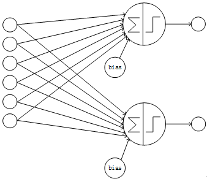

Figure 1 全连接的网络

卷积神经网络采用局部连接和参数共享的方式连接网络。对于一个卷积神经网络，假如该网络的第k层有n个节点，k+1层为卷积层且有m个节点，则k+1层的每个节点只与k层的部分节点相连，此处假设只与k层的i个节点相连（局部连接）；另外k+1层的每个节点的连接共享相同的参数、相同的bias（参数共享）。这样该卷积神经网络的第k、k+1层间共有m*i个连接、i+1个参数。由于i小于n且为常数，所以卷积层的连接数、参数数量的数量级约为O(n)，远小于全连接的O(n^2)的数量级。卷积神经网络的部分连接的结构如下图：

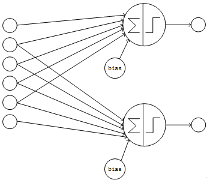

Figure 2 部分连接且卷积层各节点的输入节点有重叠的网络

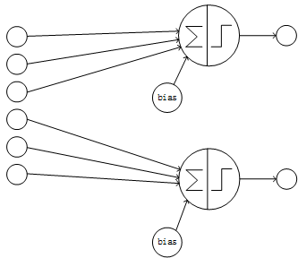

Figure 3 部分连接且卷积层各节点的输入节点无重叠的网络

卷积神经网络在使用时往往是多层的，下面通过LeNet-5的网络连接来举例说明一个卷积神经网络的结构和特点。LeNet-5是Yann LeCun在1998年设计的用于手写数字识别的卷积神经网络，是早期卷积神经网络中最有代表性的实验系统之一。

LenNet-5共有7层（不包括输入层），每层都包含不同数量的训练参数。各层的结构如Figure 4所示：

Figure 4 LeNet-5的网络结构

LeNet-5中主要的有卷积层、下抽样层、全连接层3中连接方式。全连接层在这里就不赘述。

卷积层采用的都是5x5大小的卷积核，且卷积核每次滑动一个像素，一个特征图谱使用同一个卷积核（即特征图谱内卷积核共享参数），卷积核的结构见Figure 5。每个上层节点的值乘以连接上的参数，把这些乘积及一个偏置参数相加得到一个和，把该和输入激活函数，激活函数的输出即是下一层节点的值。卷积核有5x5个连接参数加上1个偏置共26个训练参数。这样局部连接、参数共享的方式，在数学上相当于上一层节点矩阵与连接参数矩阵做卷积得到的结果矩阵，即下一层的节点值，这是卷积神经网络名字的由来。Figure 6显示了卷积神经网络连接于矩阵卷积的对应关系：

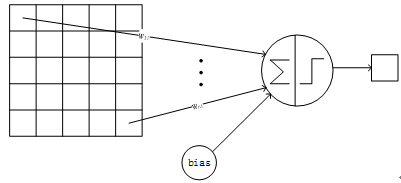

Figure 5 一个卷积节点的连接方式

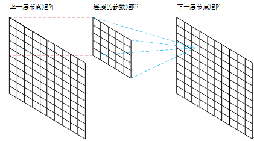

Figure 6 卷积神经网络连接与矩阵卷积的对应关系

下抽样层采用的是2x2的输入域，即上一层的4个节点作为下一层1个节点的输入，且输入域不重叠，即每次滑动2个像素，下抽样节点的结构见Figure 6。每个下抽样节点的4个输入节点求和后取平均，均值乘以一个参数加上一个偏置参数作为激活函数的输入，激活函数的输出即是下一层节点的值。一个下抽样节点只有2个训练参数。

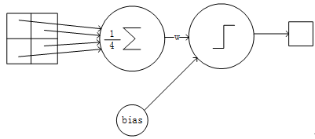

Figure 7 一个下抽样节点的连接方式

输入层是32x32像素的图片，比数据集中最大的的字符（最大体积是20x20像素的字符位于28x28像素区域的中心）大很多。这样做的原因是能使潜在的特征比如边缘的端点、拐角能够出现在最高层次的特征解码器的接收域的中心。LeNet-5的最后一个卷积层（C3，见后面）的接收域的中心与输入的32x32的图像的中心的20x20的区域相连。输入的像素值被标准化为背景色（白色）值为-0.1、前景色（黑色）值为1.175，这样使得输入的均值大致为0、方差大致为1，从而有利于加快训练的速度。

在后面的描述中，卷积层用Cx标记，子抽样层用Sx标记，全连接层用Fx标记，其中x表示该层的是LeNet的第x层。

C1层是卷积层，形成6个特征图谱。特征图谱中的每个单元与输入层的一个5x5的相邻区域相连，即卷积的输入区域大小是5x5，每个特征图谱内参数共享，即每个特征图谱内只使用一个共同卷积核，卷积核有5x5个连接参数加上1个偏置共26个参数。卷积区域每次滑动一个像素，这样卷积层形成的特征图谱每个的大小是28x28。C1层共有26x6=156个训练参数，有(5x5+1)x28x28x6=122304个连接。Figure 8 是C1层的连接结构。

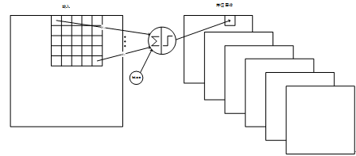

Figure 8 C1层的结构

S2层是一个下抽样层。C1层的6个28x28的特征图谱分别进行以2x2为单位的下抽样得到6个14x14的图。每个特征图谱使用一个下抽样核，每个下抽象核有两个训练参数，所以共有2x6=12个训练参数，但是有5x14x14x6=5880个连接。Figure 9是S2层的网络连接的结构。

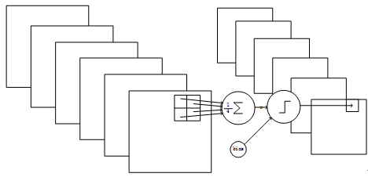

Figure 9 S2层的网络结构

C3层是一个卷积层，卷积和和C1相同，不同的是C3的每个节点与S2中的多个图相连。C3层有16个10x10的图，每个图与S2层的连接的方式如Table1 所示。C3与S2中前3个图相连的卷积结构见Figure 10.这种不对称的组合连接的方式有利于提取多种组合特征。改成有(5x5x3+1)x6 + (5x5x4 + 1) x 3 + (5x5x4 +1)x6 + (5x5x6+1)x1 = 1516个训练参数，共有1516x10x10=151600个连接。

Table 1 C3与S2的连接关系

Figure 10 C3与S2中前3个图相连的卷积结构

S4是一个下采样层。C3层的16个10x10的图分别进行以2x2为单位的下抽样得到16个5x5的图。这一层有2x16共32个训练参数，5x5x5x16=2000个连接。连接的方式与S2层类似。

C5层是一个卷积层。由于S4层的16个图的大小为5x5，与卷积核的大小相同，所以卷积后形成的图的大小为1x1。这里形成120个卷积结果。每个都与上一层的16个图相连。所以共有(5x5x16+1)x120 = 48120个参数，同样有48120个连接。C5层的网络结构见Figure 11。

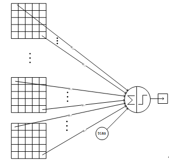

Figure 11 C5层的连接方式

F6层是全连接层。F6层有84个节点，对应于一个7x12的比特图，-1表示白色，1表示黑色，这样每个符号的比特图的黑白色就对应于一个编码。该层的训练参数和连接数是(120 + 1)x84=10164. 比特图的样式见Figure 12，连接方式见Figure 13.

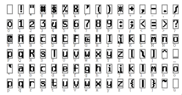

Figure 12 编码的比特图

Figure 13 F6层的连接方式

Output层也是全连接层，共有10个节点，分别代表数字0到9，且如果节点i的值为0，则网络识别的结果是数字i。采用的是径向基函数（RBF）的网络连接方式。假设x是上一层的输入，y是RBF的输出，则RBF输出的计算方式是：

的值由i的比特图编码确定。越接近于0，则越接近于，即越接近于i的比特图编码，表示当前网络输入的识别结果是字符i。该层有84x10=840个设定的参数和连接。连接的方式见Figure 14.

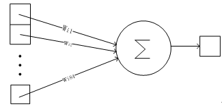

Figure 14 Output层的网络连接方式

以上是LeNet-5的卷积神经网络的完整结构，共约有60,840个训练参数，340,908个连接。一个数字识别的效果如Figure 15所示。

Figure 15 LeNet-5识别数字3的过程

通过对LeNet-5的网络结构的分析，可以直观地了解一个卷积神经网络的构建方法，为分析、构建更复杂、更多层的卷积神经网络做准备。

参考文献：

[1] Yoshua Bengio, DEEP LEARNING, Convolutional Networks, http://www.iro.umontreal.ca/~bengioy/dlbook/ .

[2] Y. LeCun, L. Bottou, Y. Bengio, and P. Haffner. Gradient-based learning applied to document recognition. Proceedings of the IEEE, november 1998.
