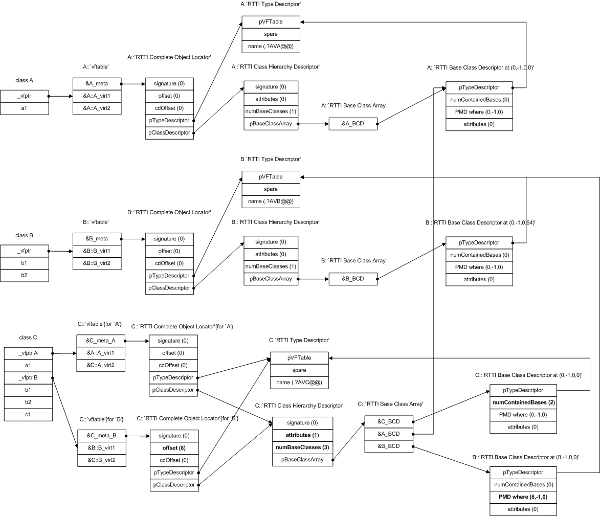

# C++的对象模型、RTTI、显式类型转换

## 对象模型和RTTI
* 对象模型（object model）是指对象（class）在内存中的布局（layout），所以更准确的说法可以是对象的内存模型。
* 对象的内存模型存储的信息主要包括成员变量、成员函数、类型信息、继承关系。其中类型信息即对应RTTI。
* RTTI（Run-time Type Identification 或者 Run-time type information）是指对象在运行时的类型信息
### 一个实例
定义如下三个类A、B、C
```cpp

class A
    {
      int a1;
    public:
      virtual int A_virt1();
      virtual int A_virt2();
      static void A_static1();
      void A_simple1();
    };

    class B
    {
      int b1;
      int b2;
    public:
      virtual int B_virt1();
      virtual int B_virt2();
    };

    class C: public A, public B
    {
      int c1;
    public:
      virtual int A_virt2();
      virtual int B_virt2();
    };

```
那么A、B、C的内存模型如下图：



## static_cast 和 dynamic_cast 的区别
* 类型转换（type cast）是指将一个对象从一种类型转换成另一种类型，其中C++的显示类型转换包括static_cast、dynamic_cast、const_cast、reinterpret_cast四种
* static_cast 是编译时确定下来，程序无法判定类型转换是否安全，需要进行类型转换的程序员来保证类型转换的安全
* dynamic_cast 是在运行时确定的，程序可以推断类型转换是否安全
* dynamic_cast 依赖 RTTI 中的类型信息来判断类型转换是否安全

## 示例


## 参考文档
* Static_cast 与 Dynamic_cast的区别，http://www.cnblogs.com/zhyg6516/archive/2011/03/07/1971898.html
* Reversing Microsoft Visual C++ Part II: Classes, Methods and RTTI，http://www.openrce.org/articles/full_view/23